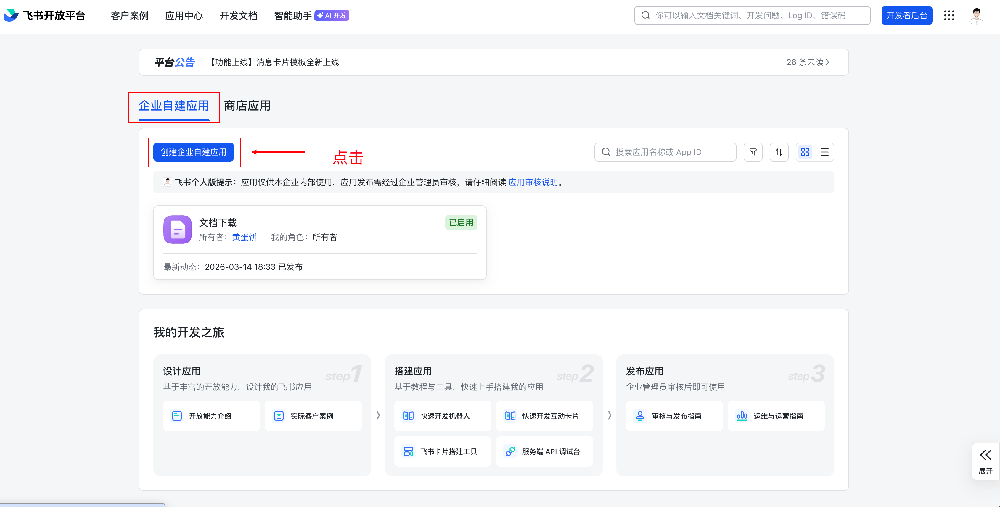
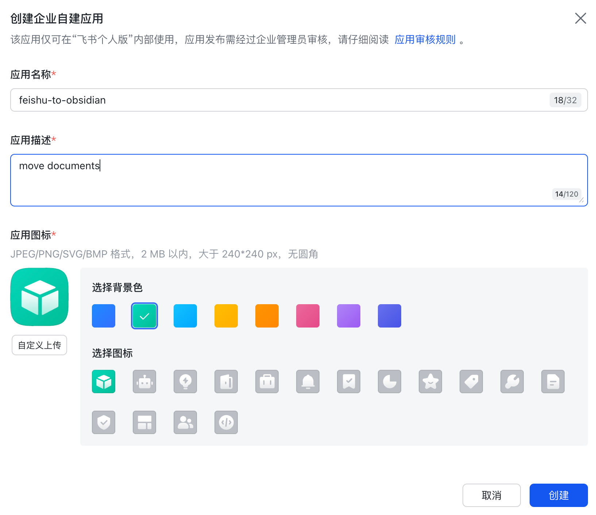
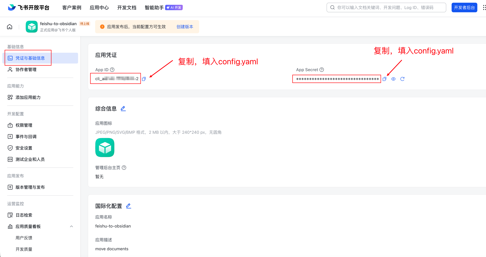
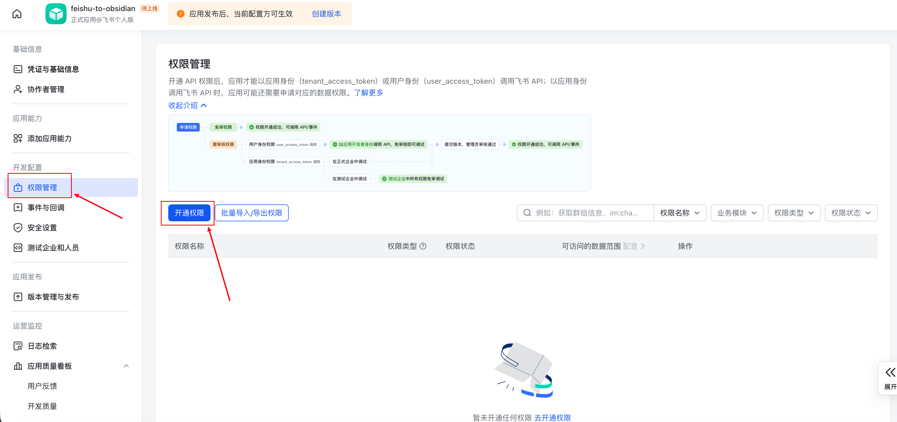
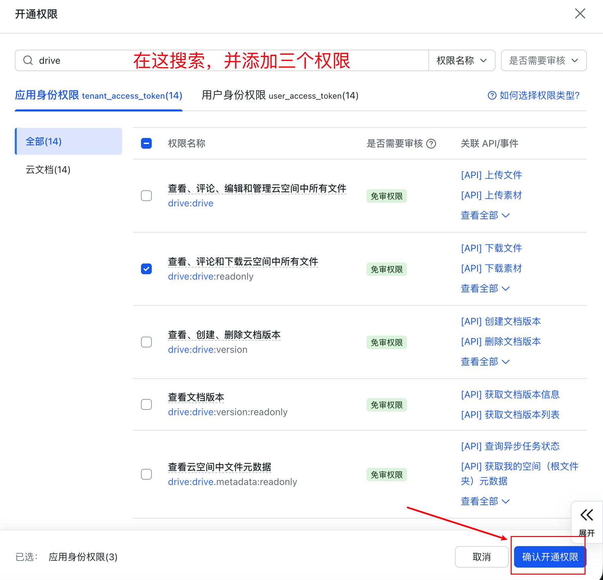
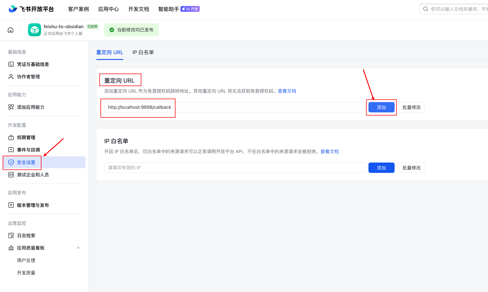
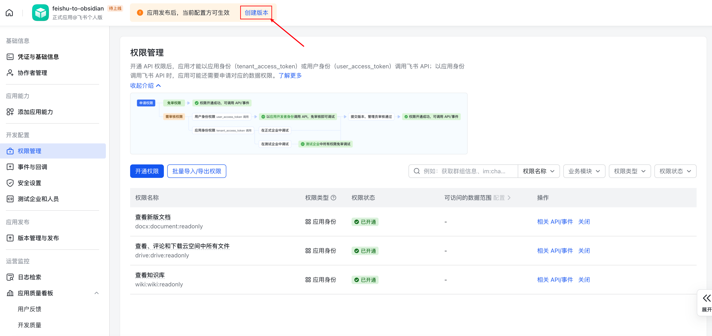
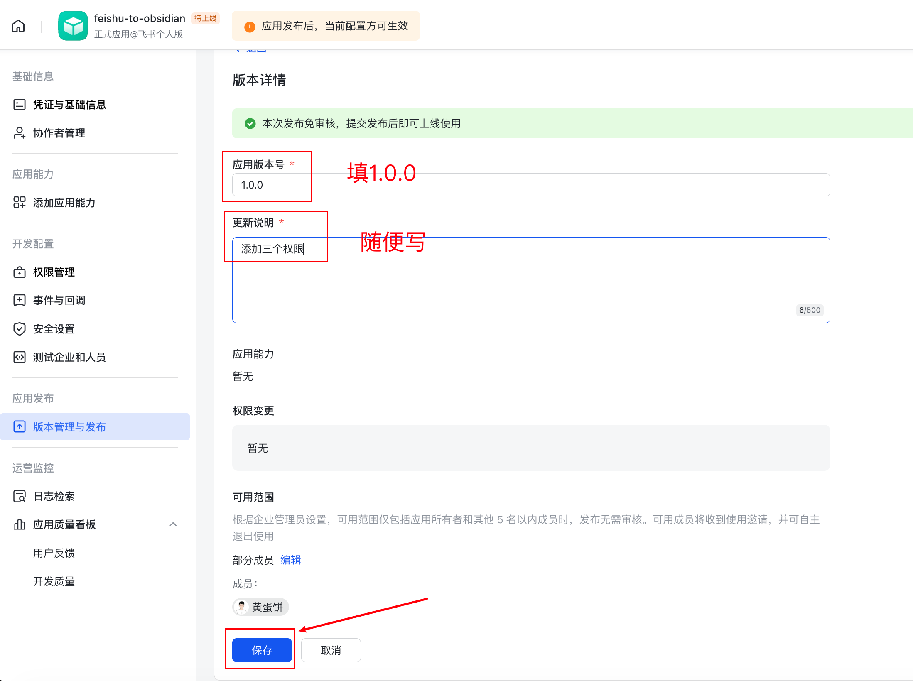
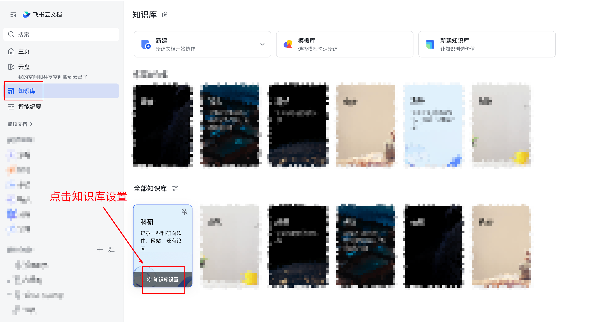

# feishu-to-obsidian

中文 | [English](README_EN.md)

将飞书 Wiki 知识库批量迁移至 Obsidian，保留完整层级结构，自动本地化图片附件，支持增量同步。让 Obsidian 中的 Claude 直接索引你的知识库，获得 AI 加持的沉浸式阅读体验。

## 为什么用 feishu-to-obsidian？

很多人长期在飞书云文档里积累知识库，但飞书的 AI 能力有限，难以做到真正的知识沉淀与检索。

**feishu-to-obsidian 解决两件事：**

**1. 让 AI 读懂你的飞书知识库**

Obsidian 中的 [Claudian](https://github.com/YishenTu/claudian) 等插件可以让 Claude 直接索引本地 vault，对你的知识库提问、总结、关联。但前提是内容必须在本地。这个工具把飞书 Wiki 完整转换为 Obsidian vault，让你的知识库立刻获得 AI 加持。

**2. 持续增量同步，保持两端一致**

不是"一次性导出"。你继续在飞书上写文档，定时跑一次（或配置 crontab）即可将新增和修改的内容同步到 Obsidian，两端长期保持一致，不需要手动维护。

**功能亮点：**

- 递归导出整个 Wiki 空间，目录结构与飞书层级一致
- 自动下载图片，本地化存储
- 增量同步：跳过未修改的文档
- 可选：将飞书内链转换为 Obsidian wikilinks
- 支持 frontmatter（创建时间、修改时间、原始链接）

---

## 快速开始

**前置条件：**

- Python 3.11+
- 飞书云文档账号，并拥有目标 Wiki 空间的访问权限

**安装：**

```bash
git clone https://github.com/horacehht/feishu-to-obsidian.git
cd feishu-to-obsidian
pip install -r requirements.txt
```

---

## 配置

运行前需要完成飞书开放平台的授权配置，并填写 `config.yaml`。

### 第一步：获取 `app_id` 和 `app_secret`

**第 1 步：进入飞书开放平台**

访问 `https://open.feishu.cn/app`，使用飞书账号登录。

**第 2 步：创建自建应用**

点击「创建企业自建应用」，填写下方信息后，点击"创建"按钮

- 应用名称（如 `feishu-to-obsidian`）
- 应用描述（可随意填写）





**第 3 步：复制 App ID 和 App Secret**

左侧菜单 →「凭证与基础信息」→ 即可看到：

- **App ID**：填入 config.yaml 的 `app_id`
- **App Secret**：点击「查看」后填入 `app_secret`

⚠️ App Secret 等同于密码，不要提交到 Git 或分享给他人。



**第 4 步：开通必要权限**

左侧菜单 →「权限管理」→ 搜索并开通以下三个权限：

| 权限标识                   | 说明                 |
| -------------------------- | -------------------- |
| `wiki:wiki:readonly`     | 读取 Wiki 空间和节点 |
| `docx:document:readonly` | 读取文档内容         |
| `drive:drive:readonly`   | 下载文档内图片       |





**第 5 步：增加重定向URL**

左侧菜单 →「安全设置」→ 在重定向URL下添加 `http://localhost:9898/callback`



**第 6 步：发布应用**

左侧菜单 →「版本管理与发布」→ 创建版本 → 申请发布。

> 注：企业内部发布需管理员审批；若自己是管理员可直接通过。





### 第二步：获取 `space_id`（Wiki 空间 ID）

1. 在飞书中打开目标 Wiki 空间首页，点击知识库设置
2. 浏览器地址栏此时变为：
   `https://xxx.feishu.cn/wiki/settings/<space_id>`
3. 复制地址栏末尾的那串 ID，填入 config.yaml 的 `space_id`



### 第三步：填写 config.yaml

完整配置示例（含所有字段说明）：

```yaml
# 飞书应用凭据（从飞书开放平台获取）
# https://open.feishu.cn/app → 创建自建应用 → 凭证与基础信息
app_id: "cli_xxxxxxxxxxxxxxxx"
app_secret: "xxxxxxxxxxxxxxxxxxxxxxxxxxxxxxxx"

# 导出目标目录（Obsidian vault 路径），请修改为你自己的vault路径
output_dir: "~/obsidian-vault"

# 要迁移的 Wiki 空间列表（可多个）
# space_id 获取方式：Wiki 页面地址栏 → xxx.feishu.cn/wiki/xxxxxxxx 中的路径部分
# 或在 Wiki 设置页面查看
wiki_spaces:
  - space_id: "xxxxxxxx"
    name: "knowledge"        # 迁移到本地的文件夹命名

# 可选：迁移单篇文档（document_id 来自飞书文档 URL）
# single_docs:
#   - doc_id: "xxxxxxxx"

# Obsidian 链接风格
# "wikilink" → [[文件名]]
# "markdown" → [标题](./path/file.md)
link_style: "wikilink"

# 附件存放位置，对应 Obsidian「Files and links → Default location for new attachments」
# vault_folder     → 存入 <output_dir>/<assets_dir>/（vault 统一附件目录）
# same_folder      → 存入与文档相同的目录
# subfolder        → 存入文档同级的 <assets_dir>/ 子目录（默认，推荐）
# specified_folder → 存入 <output_dir>/<assets_dir>/（与 vault_folder 等价）
attachments_location: "subfolder"

# 附件子目录名（attachments_location 为 subfolder / vault_folder / specified_folder 时生效）
assets_dir: "attachments"

# 速率限制（飞书 API 限制约 100 req/min）
rate_limit_per_minute: 60

# 增量同步：记录已导出文档的修改时间
sync_state_file: ".feishu_sync_state.json"

# 文档 frontmatter 选项
frontmatter:
  include_created_time: true
  include_modified_time: true
  include_feishu_url: true
  include_owner: false
```

---

## 使用

### 迁移（migrate.py）

```bash
python migrate.py                          # 全量迁移
python migrate.py --incremental            # 增量同步（跳过未修改文档）
python migrate.py --limit 3               # 测试：只迁移前 3 篇
python migrate.py --doc-id <document_id>   # 调试：只导出单篇文档
python migrate.py --config other.yaml      # 指定其他配置文件
```

首次运行会**自动打开浏览器完成 OAuth 授权**，在跳出的网页中点击"确认"即可，token 缓存于 `.token_cache.json`，后续运行不再弹出。

之后可以通过 crontab 配置定时增量同步，将 `/path/to/feishu-to-obsidian` 替换为你的项目路径：

```bash
# 每天早上 7 点同步
(crontab -l 2>/dev/null; echo "0 7 * * * cd /path/to/feishu-to-obsidian && python migrate.py --config config.yaml --incremental >> /tmp/feishu_sync.log 2>&1") | crontab -

# 每隔 2 小时同步一次
(crontab -l 2>/dev/null; echo "0 */2 * * * cd /path/to/feishu-to-obsidian && python migrate.py --config config.yaml --incremental >> /tmp/feishu_sync.log 2>&1") | crontab -

# 每周一早上 9 点同步一次
(crontab -l 2>/dev/null; echo "0 9 * * 1 cd /path/to/feishu-to-obsidian && python migrate.py --config config.yaml --incremental >> /tmp/feishu_sync.log 2>&1") | crontab -
```

运行 `crontab -l` 可查看当前已配置的定时任务，同步日志写入 `/tmp/feishu_sync.log`。

### 后处理链接（post_process.py，可选）

将文档内的飞书原始链接转换为 Obsidian wikilinks：

```bash
python post_process.py           # 将飞书链接转为 Obsidian wikilinks
python post_process.py --dry-run # 预览模式，不修改文件
```

### 迁移前估算图片所占存储空间（count_images.py，可选）

```bash
python count_images.py           # 统计图片数量与预估占用空间
```

执行这个脚本可以提前估计下载知识库的文档会在本地占多少存储空间。

---

## 输出说明

- 目录结构与 Wiki 层级保持一致
- 图片/附件位置由 `attachments_location` 控制（默认 `subfolder`，存于各文档同级的 `<assets_dir>/` 子目录），与 Obsidian「Default location for new attachments」四种模式对齐
- `.feishu_sync_state.json`：增量同步状态记录，存放在 `~/obsidian-vault` 目录中
- `migrate_errors.json`：失败文档列表（出现时生成）
- `post_process_report.json`：链接转换统计报告

---

## 常见问题

**Q：找不到「空间设置」入口？**
需要拥有该 Wiki 空间的管理员权限才能看到设置入口。

**Q：运行时报"权限不足"错误？**
检查第 4 步是否开通了全部三个权限，以及应用是否已完成发布（版本管理与发布）。

**Q：首次运行浏览器弹出授权页？**
正常现象。完成一次 OAuth 授权后，token 会缓存到 `.token_cache.json`，后续运行不再弹出。
